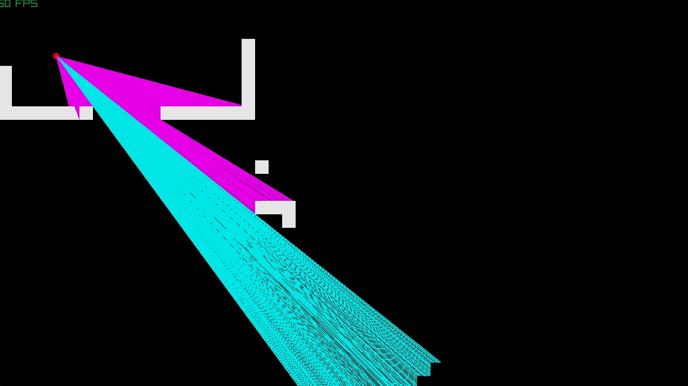

# My Raycasting Engine

This project aims to implement a [Wolfenstein 3D](https://pt.wikipedia.org/wiki/Wolfenstein_3D)-type raycasting engine. I'm developing it using C, with the [Raylib](https://www.raylib.com/) framework.

## Capabilites

- Loading a map from a map file (see the [map file](#map-files) section).
- Exploring a map using a 2D or 3D view.
- Different wall types.
- Transparent walls.
- Textured walls.

### Future plans
- Ground and ceiling/sky textures
- Transparent tile back drawing
- More stuff that I can't remember right now.

## Controls

- **Movement:** WASD.
- **Rotate camera:** Left and Right arrow keys.
- **Switch 2D and 3D view:** G.
- **Quit:** Esc.

## Building
There is at least one Linux and Windows build available in the _releases_ tab, but you can follow the guide here for doing it yourself.

### Linux
**1. Clone** this repository (```git clone git@github.com:Apmds/raycaster.git```) and change directory to the project root (```cd raycaster/```)

**2. Build:**
```
cd build
./premake5 gmake2
cd ..
make
```
If there are errors during compilation, womp womp ig.

**3. Run:** the executable file should be in ```bin/Debug/```, named ```raycaster```.

### Windows
I don't know how to compile using Visual Studio and I haven't searched for it, so these instructions apply to those that use [w64devkit](https://github.com/skeeto/w64devkit/releases).
If you really want to use Visual Studio, you can follow the [quickstart projects](https://github.com/raylib-extras/raylib-quickstart/) instructions for it.

**1. Clone** this repository (```git clone https://github.com/Apmds/raycaster.git```).

**2. Build:** Using w64devkit:
```
cd /path/to/raycaster/
cd build
./premake5.exe gmake2
cd ..
make
```
If there are errors during compilation, refer to the [Linux](#linux) section.

**3. Run:** the executable file should be in ```bin/Debug/```, named ```raycaster```.

### MacOS
**If** I get a build of it using MacOS, I'll detail the process here.


## Map files
I like map files to have a ```.map``` extension, but it can be any. There is an example map file in the **resources** folder.

Each map in this (and most) raycasting engines is made up of a **2D grid** of tiles.
The tile coordinates start at 0 in the **top left** corner, with x growing from **left to right** and y growing **from top to bottom**. By default, each tile is a GROUND tile.

Currently, the map files define:
- The maximum size (in grid units) of the map in the X and Y axis.
- The size (in pixels) of each tile.
- What type a tile has at its coordinates.

### Structure
The **first** line of the file follows the structure ```<sizeX>,<sizeY>,<tileSize>```, which defines the number of tiles in each axis of the map and the _pixel_ size of the tiles.

**Every** line after that has the structure ```<posX>,<posY>,<tileType>```, which defines the type of tile that is at the coordinates.

### Tile types
- GROUND: ground tile (default)
- WALL1: generic wall tile
- WALL2: generic wall tile
- WALL_TRANSPARENT: generic wall tile (transparent)

## Screenshots




## Credits

This project was setup using [this quickstart project](https://github.com/raylib-extras/raylib-quickstart/).

For guidance on development, I've been using the concepts described on [Lode's Computer Graphics Tutorial](https://lodev.org/cgtutor/raycasting.html).
