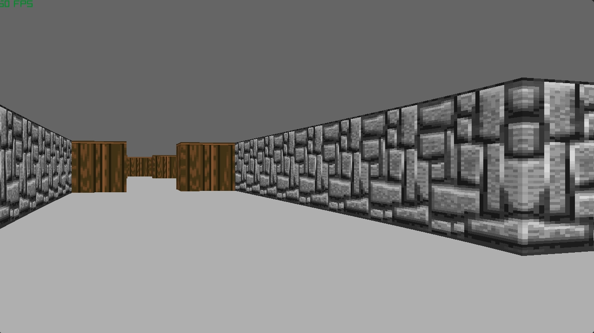
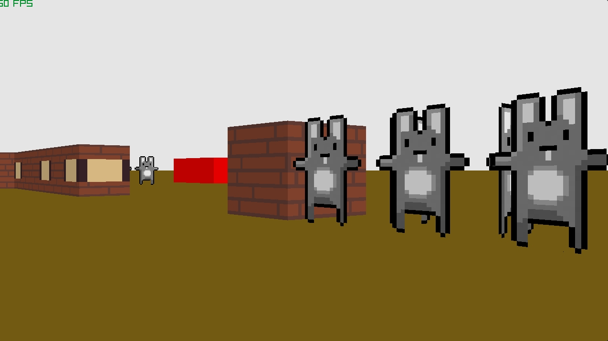

# My Raycasting Engine

This project aims to implement a [Wolfenstein 3D](https://pt.wikipedia.org/wiki/Wolfenstein_3D)-type raycasting engine. I'm developing it using C, with the [Raylib](https://www.raylib.com/) framework.

It also features an implementation of linked lists, hashmaps and a *mostly* working [TOML](https://toml.io/) parser for the map files.

## Capabilites

- Loading a map from a map file (see the [map file](#map-files) section).
- Exploring a map using a 2D or 3D view.
- Texture-mapped and colored walls.
- Transparent walls.
- Custom wall types.
- Colored floor and ceiling

### Future plans
- Ground and ceiling/sky textures
- Transparent tile back drawing
- Arraylist implementation

## Controls

- **Movement:** WASD.
- **Rotate camera:** Left and Right arrow keys.
- **Switch 2D and 3D view:** G.
- **Reload map:** R.
- **Quit:** Q.

## Building
There is at least one Linux and Windows build available in the _releases_ tab, but you can follow the guide here for doing it yourself.

### Linux
**1. Clone** this repository (```git clone git@github.com:Apmds/raycaster.git```) and change directory to the project root (```cd raycaster/```)

**2. Build:**
```
cd build
./premake5 gmake2
cd ..
make
```

The executable file is in ```bin/Debug/```, named ```raycaster```.

### Windows
I don't know how to compile using Visual Studio and I haven't searched for it, so these instructions apply to those that use [w64devkit](https://github.com/skeeto/w64devkit/releases).
If you really want to use Visual Studio, you can follow the [quickstart projects](https://github.com/raylib-extras/raylib-quickstart/) instructions for it.

**1. Clone** this repository (```git clone https://github.com/Apmds/raycaster.git```).

**2. Build:** Using w64devkit:
```
cd /path/to/raycaster/
cd build
./premake5.exe gmake2
cd ..
make
```

The executable file is in ```bin/Debug/```, named ```raycaster```.

### MacOS
**If** I get a build of it using MacOS, I'll detail the process here.

## Running

Execute ```raycaster <mapfile>``` while in the same directory as the [resources](resources/) folder.
The [resources](resources/) folder contains example maps to test the raycaster.

## Map files
The map files have the ```.map``` extension and their syntax is a subset of [TOML](https://toml.io/), so the terminology lines up.

Each map is made up of a **2D grid** of tiles.
The tile coordinates start at 0 in the **top left** corner, with x growing from **left to right** and y growing **from top to bottom**. By default, each tile is a GROUND tile.

Currently, the map files define:
- Map dimensions (grid width and height).
- Tile size (in pixels).
- Setting floor and ceiling colors.
- Defining tile types.
- What type a tile has at some coordinates.

### Structure
The raycaster looks for the following tables to successfully load a map into memory:
- **MapSettings**: Where the map variables are set.
- **TileDefinition**: Where the tile types are defined.
- **TilePlacing**: Where the tiles are placed in the map.

Some parameters have a ```color``` type, which is an RGB(A) array.

#### MapSettings

- **mapSize**: ```[width : int, height : int]``` map dimensions.
- **tileSize**: an integer defining the pixel size of each tile.
- **ceilingColor**: the color of the ceiling.
- **groundColor**: the color of the ground.

#### TileDefinition

To define a tile, follow this syntax:
```
<TILE_NAME> : {surface: <string|color>, transparent (optional): <bool>}
```
A tile's surface is either a string with the texture name or a color, in case of a solid color tile.
If ```transparent``` is set to ```true```, the walls behind this tile will also be rendered.

#### TilePlacing

- **Tiles**: An array containing the tile placement information, which follows this template:```[<tileX : int>, <tileY : int>, <tileName : string>]```

## Screenshots





## Credits

This project was setup using [this quickstart project](https://github.com/raylib-extras/raylib-quickstart/).

For guidance on development, I've been using the concepts described on [Lode's Computer Graphics Tutorial](https://lodev.org/cgtutor/raycasting.html).
